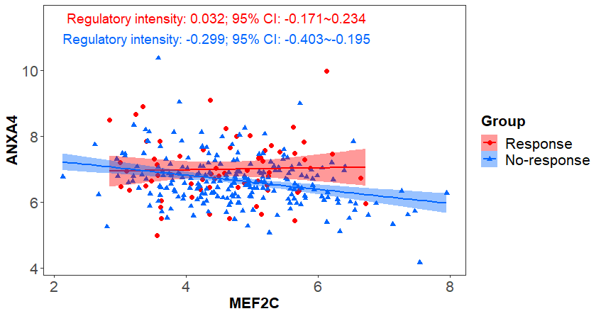

## Introduction

Tumorigenesis is believed to be triggered by a series of events such as DNA mutation, chromosomal variation, aberrant epigenetic modifica-tion, and further driven by dysfunctional regulation of gene expression programs [@Hanahan2011][@Lee2013]. Gene dysregulation has even been suggested as a hallmark of cancer [@Bradner2017]. The phenotypic heterogeneity of tumors, like drug response, metastasis, and survival time, could thus be ascribed, at least in part, to gene dysregulations. In this sense, investigating transcriptional dysregulations helps to understand the molecular mechanisms underlying phenotypic changes and promotes the implementation of cancer precision medicine. Specifically, gene dysregulation analysis has the potential to provide functionally relevant seeds for building predictive signatures with both predictive power and explanatory power, which to some extent address the issue that most of current efforts to build signatures for predicting prognosis and therapeutic benefits are focusing on predictive accuracy rather than on mechanistic interpretability [@Robinson2013].

**DysRegSig** is a robust tool to perform gene dysregulation analysis from high-dimensional data while taking the cooperativity and synergy between regulators to target into consideration. DysRegSig offers DCA tools including DiffCor and DiffCor++, which combines traditional DCA, differential expression analysis, and the estimation of the consistency between differential coexpression and differential expression. DysRegSig also offers following analysis modules to rank dysregulated regulations and TFs, and cosntruct mechanistic signature with gene dysregulations by using genetic algorithm.

## Install **DysRegSig**

DysRegSig dependents packages Boruta, RGBM, glmnet, expm, flare, limma, ggpubr, ggplot2, reshape2, igraph, survival, survcomp, survminer, ROCR, pROC, e1071, and so on. At first, Bioconductor packages need to be pre-installed.

```{r, eval = FALSE}
if(!require(BiocManager)) install.packages("BiocManager")
library(BiocManager)
install(c('limma','survcomp'))
```

Then use devtools to install DysRegSig package from github.

```{r, eval = FALSE}
if(!require(devtools)) install.packages("devtools")
devtools::install_github('SCBIT-YYLab/DysRegSig')
```

```{r, eval = FALSE}
library(DysRegSig)
```

## Gene dysregulation analysis

### Identify gene dysregulations

In **DysRegSig**, the main function for gene dysregulation analysis is `DysReg`, which is capable of robustly identifying gene dysregulations from high-dimensional expression data with cooperativity and synergy between regulators and several other transcriptional regulation rules taken into consideration. `DysReg` first builds condtional GRNs with feature selection algorithm such as Boruta [@Kursa2010], then quantifies regulatory intensities of every regula-tion relationships and their confidence intervals with de-biased LASSO [@Javanmard2014], and eventually identifies gene dysregulations by integrating three standards incluidng differential regulation, differential expression of target, and the consistency between differential regulation and differential expression [@Li2017]. 

```{r, eval = FALSE}
data(ExpData)
ExpData[1:5,1:5]

data(tf2tar)
head(tf2tar)

data(ClinData)
head(ClinData)

group.1 <- ClinData$sample[which(ClinData$binaryResponse == 'CR/PR')]
exp.1 <- ExpData[,colnames(ExpData) %in% group.1]

group.2 <- ClinData$sample[which(ClinData$binaryResponse == 'SD/PD')]
exp.2 <- ExpData[,colnames(ExpData) %in% group.2]

dysreg.out <- DysReg(exp.1 = exp.1, exp.2 = exp.2, tf2tar, 
                     de.genes = NULL, de.pval = 0.05, 
                     grn.method = 'Boruta', 
                     pValue = 0.01, ci = 0.90, verbose = T)

dysreg.res <- dysreg.out$dysreg
head(dysreg.res)

```

**DysRegSig** also offers two other methods for gene dysregulation analysis, `DiffCor` and `DiffCorPlus`. DiffCor uses Fisher's z-test to analyze the differences of correlation coefficients between two conditions for each TF-target in reference GRN. 
```{r, eval = FALSE}
diffcor.res <- DiffCor(exp.1 = exp.1, exp.2 = exp.2, tf2tar, 
                       cor.method = 'pearson', p.adj = 'BH',
                       verbose = TRUE)
                       
## set cutoff
diffcor.res <- subset(diffcor.res,p.val < 0.05)
head(diffcor.res)
```

DiffCorPlus combines two factors proposed in DysRegSig, target expression change and the regulator’s contribution to the target with DiffCor.
```{r, eval = FALSE}

diffcor.p.res <- DiffCorPlus(exp.1 = exp.1,exp.2 = exp.2, tf2tar, 
                             de.genes = NULL, de.pval = 0.05, 
                             cor.method = 'pearson', p.adj = 'BH')

## set cutoff
diffcor.p.res <- subset(diffcor.p.res,p.val < 0.05)
head(diffcor.p.res)
```


### Visualize expression of gene dysregulation between conditions

The expression pattern of two genes in one gene dysregulaiton could be visulazied by function `plotDysRegExp` (**Figure 1**). In order to more clearly visualize the differences of gene regulation between conditions, `plotDysRegExp` adds the regression lines and confidence interval shadows calculated by single variable regression for each condition. 

```{r, eval = FALSE}
plotDysregExp(tf = dysreg.res$TF[1], tar = dysreg.res$Target[1],
              exp.1 = exp.1, exp.2 = exp.2, 
              exp1.label = 'Response', exp2.label = 'No-response',
              dysreg = dysreg.res, method ='DysReg', 
              conf.int.level = 0.95)
```


<b>Figure 1</b> - The plot shows the expression pattern of two genes in one gene dysregulaiton. X-axis denotes TF’s expression level and y-axis denotes target’s expression level. One point corresponds to one sample. The regression lines and confidence interval shadows were calculated by single variable regression and used to visualize the differences of gene regulation between conditions. 

## Subsequent analysis of gene dysregulations

### Rank gene dysregulations and TFs

`RankDysReg` could be used to quantify the degree of gene dysregulations based on the change of regulatory intensities and target expression between conditions, and rank dysregulations.

```{r, eval = FALSE}
reg.rank <- RankDysReg(dysreg.res)
head(reg.rank)

```

In addition, `RankDysTF` could be used to quantify and rank the degree of TFs.

```{r, eval = FALSE}
tf.rank <- RankDysTF(dysreg.res)
head(tf.rank)

```

### cosntruct mechanistic signature with gene dysregulations

Most of current efforts in the field of developoing signature for cancer precision medicine are paying much more attention to predictive accuracy than to molecular mechanistic interpretability. However, there is a general consensus among both clinicians and biologists about the need for signatures with mechanistic interpretability as well as high predictive accuracy for cancer precision medicine [@Robinson2013]. It could also be expected that taking mechanistic interpretation into consideration would further enhance the predictive accuracy and robustness of signatures in clinical application [@Robinson2013]. Specifically, gene dysregulation analysis has been proved to have the potential to provide functionally relevant seeds for building predictive signatures with both predictive power and explanatory power, which could offer some mechanistic information for signature.

In **DysRegSig**, `combineDysReg` could be used to screen the dysregulations that are robustly associated with a specific phenotype by using genetic algorithm and combine the dysregulations for constructing signature. In this example, the dysregulations that have robustly association with drug response were screened out, which could be used to construct mechanistic signature for drug response.

```{r, eval = FALSE}
dysreg <- dysreg.res[,1:2]

pheno.data <- ClinData[,c("sample", "binaryResponse")]
pheno.data <- pheno.data[!is.na(pheno.data$binaryResponse),]
colnames(pheno.data)[2] <- "clin.factor"
head(pheno.data)

## use genetic algorithm to search the best combination of dysregulations
combdysreg.out <- combineDysreg(dysreg = dysreg, exp.data = ExpData,
                                fitness.func = 'fitness.AUC', 
                                pheno.data = pheno.data, 
                                pop.size = 1000, select.rate=0.2, 
                                mut.rate=0.1, add.rate=0.1, 
                                topN = 10, train.rate = 0.6, iter = 100)

## Check the output of combineDysreg
best.fit <- combdysreg.out$best.fitness
best.individ <- combdysreg.out$individ
head(best.fit)

## THe example for selceting the gene dysregulations that are robustly associated with the phenotype.

# calculate the frequence of each each dysregualtion among the top N best individuals
freq.res <- vector()
for(i in 1:100){
  start <- 10*i-9
  end <- 10*i
  iter.i <- best.individ[start:end,]
  iter.i <- colSums(iter.i)/10
  freq.res <- rbind(freq.res,iter.i)
}
freq.res <- t(freq.res)
colnames(freq.res) <- c(1:100)
rownames(freq.res) <- paste(dysreg$TF,dysreg$Target,sep = '-')

# visualize the frequence of each each dysregualtion among the top N best individuals
pheatmap(freq.res,color = colorRampPalette(c('lightyellow',"orange", "firebrick3"))(1000), 
         display_numbers = F, cluster_rows = F,cluster_cols = F,
         fontsize_row = 8, fontsize_col = 10)
         
# choose the dysregulations frequently emerged among the top N best individuals as signatures
marker.dsyergulations <- rownames(freq.res)[freq.res[,100] >= 0.9]

```

 Session information
```{r label='Session information', eval=TRUE, echo=FALSE}
sessionInfo()
```

## References


