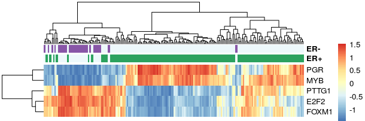

# Overview

Tumorigenesis is believed to be triggered by a series of events such as DNA mutation, chromosomal variation, aberrant epigenetic modifica-tion, and further driven by dysfunctional regulation of gene expression programs (Hanahan and Weinberg, 2011; Lee and Young, 2013). Gene dysregulation has even been suggested as a hallmark of cancer [@Bradner2017]. The phenotypic heterogeneity of tumors, like drug response, metastasis, and survival time, could thus be ascribed, at least in part, to gene dysregulations. In this sense, investigating transcriptional dysregulations helps to understand the molecular mechanisms underlying phenotypic changes and promotes the implementation of cancer precision medicine. Specifically, gene dysregulation analysis has the potential to provide functionally relevant seeds for building predictive signatures with both predictive power and explanatory power, which to some extent overcome the problem in precision medicine that most of current efforts to build signatures for predicting prognosis and therapeutic benefits are focusing on predictive accuracy rather than on mechanistic interpretability.

**DysRegSig** is a robust tool to perform gene dysregulation analysis from high-dimensional data while taking the combinational effect of multiple regulators to target into consideration. DysRegSig also offers three following analysis modules, including modules of exploring the association of individual gene dysregulaiton to clinical factors, ranking dysregulated regulations and TFs, and building mechanistic signature with gene dysregulations by using genetic algorithm.

# Install **DysRegSig**

DysRegSig dependents packages Boruta, RGBM, glmnet, expm, flare, limma, ggpubr, ggplot2, reshape2, igraph, survival, survcomp, survminer, ROCR, pROC, e1071, and so on. At first, Bioconductor packages need to be pre-installed.

```{r, eval = FALSE}
if(!require(BiocManager)) install.packages("BiocManager")
library(BiocManager)
install(c('limma','survcomp'))
```

Then use devtools to install DysRegSig package from github.

```{r, eval = FALSE}
if(!require(devtools)) install.packages("devtools")
devtools::install_github('SCBIT-YYLab/DysRegSig')

library(DysRegSig)
```

```{r, eval = FALSE}
library(DysRegSig)
```

# Gene dysregulation analysis

## Identify gene dysregulations

In **DysRegSig**, the main function for gene dysregulation analysis is `DysReg`, which could idnetify gene dysregulations from high-dimensional data while considering the combinational effect of multiple regulators to target. DysReg first build conditional GRNs with tree-based feature selection algorithm, where  regulatory intensity and its confidential interval of each linkis estimated with a de-biased LASSO method. Gene dysregulations were then identified by integrating three properties including differential regulation, differential expression of target, and the consistency between differential regulation and differential expression.

```{r, eval = FALSE}
data(ExpData)
ExpData[1:5,1:5]

data(tf2tar)
head(tf2tar)

data(ClinData)
head(ClinData)

group.1 <- ClinData$sample[which(ClinData$binaryResponse == 'CR/PR')]
exp.1 <- ExpData[,colnames(ExpData) %in% group.1]

group.2 <- ClinData$sample[which(ClinData$binaryResponse == 'SD/PD')]
exp.2 <- ExpData[,colnames(ExpData) %in% group.2]

dysreg.out <- DysReg(exp.1 = exp.1, exp.2 = exp.2, tf2tar, 
                     de.genes = NULL, de.pval = 0.05, 
                     grn.method = 'Boruta', 
                     pValue = 0.01, ci = 0.90, verbose = T)

dysreg.res <- dysreg.out$dysreg
head(dysreg.res)

```

## Visualize expression of gene dysregulation between conditions

The expression pattern of two genes in one gene dysregulaiton could be visulazied by function `plotDysRegExp` (**Figure 1**). In order to more clearly visualize the differences of gene regulation between conditions, `plotDysRegExp` adds the regression lines and confidence interval shadows calculated by single variable regression for each condtion. 

```{r, eval = FALSE}
plotDysregExp(tf = dysreg.res$TF[1], tar = dysreg.res$Target[1],
              exp.1 = exp.1,exp.2 = exp.2, exp1.lab = 'PD',exp2.lab = 'RP',
              dysreg = dysreg.res, method ='dysreg', conf.int.level = 0.95)
```


<b>Figure 1</b> - The plot shows the expression pattern of two genes in one gene dysregulaiton. X-axis denotes TF’s expression level and y-axis denotes target’s expression level. One point corresponds to one sample. The regression lines and confidence interval shadows were calculated by single variable regression and used to visualize the differences of gene regulation between conditions. 

# Subsequent analysis of gene dysregulations

## Explore the association of individual gene dysregulation with clinical factor
`DysRegClin` could be used to explore the association of individual gene dysregulation with differnt types of clinical factors, including survival data, descrete type of clinical data( such as drug response) and continuous type of clinical data (such as age). `DysRegClin` first cut samples into different subgroups, for example, cutting samples with meidian expression of TF and Target into four subgroups; then uses different statistical methods to analyse the assication with clinical factors.

```{r, eval = FALSE}

# for continuous data type                                         
clin.data <- ClinData[,c("sample", "FMOne mutation burden per MB")]
clin.data <- clin.data[!is.na(clin.data$`FMOne mutation burden per MB`),]
head(clin.data)

DysregClin(tf = dysreg.res$TF[1], tar = dysreg.res$Target[1], 
           exp.data = ExpData, clin.data = clin.data,
           clin.data.type = 'continuous')

#for discrete data type                                           
clin.data <- ClinData[,c("sample", "Immune phenotype")]
clin.data <- clin.data[!is.na(clin.data$`Immune phenotype`),]
head(clin.data)

DysregClin(tf = dysreg.res$TF[1], tar = dysreg.res$Target[1], 
           exp.data = ExpData, clin.data = clin.data, 
           clin.data.type = 'discrete',
           divide.point = median)
                  
# for survival data type                                        
clin.data <- ClinData[,c("sample", "os","censOS")]
clin.data <- clin.data[!is.na(clin.data$os) & !is.na(clin.data$censOS),]
colnames(clin.data)[2:3] <- c('time','status')
head(clin.data)

DysregClin(tf = dysreg.res$TF[1], tar = dysreg.res$Target[1], 
           exp.data = ExpData, clin.data = clin.data, 
           clin.data.type = 'survival')
```

For survial data, `plotDysRegKM` could be used to plot the Kaplan-Meier curves between subgroups divided by a single gene dysregualtion (**Figure 2**). 

```{r, eval = FALSE}
plotDysregKM(tf = dysreg.res$TF[1], tar = dysreg.res$Target[1], 
              exp.data = ExpData, surv.data = surv.data, 
              divede.point = median, 
              xlab = 'Months', ylab = 'Survival probability', 
              pval = TRUE, pval.method = TRUE,
              legend.position = c(0.8,0.9))
```


<b>Figure 2</b> - The  Kaplan-Meier curves between subgroups divided by a single gene dysregualtion.

## Rank gene dysregulations and TFs

`RankDysReg` could be used to quantify the degree of gene dysregulations based on the change of regulatory intensities and target expression between conditions, and rank dysregulations.

```{r, eval = FALSE}
reg.rank <- RankDysReg(dysreg.res)
reg.rank[1:10,]

```

In addition, `RankDysTF` could be used to quantify and rank the degree of TFs.

```{r, eval = FALSE}
tf.rank <- RankDysTF(dysreg.res)
tf.rank[1:10,]

```

## Build mechanistic signature with gene dysregulations

Most of current efforts in the field of developoing signature for cancer precision medicine are paying much more attention to predictive accuracy than to molecular mechanistic interpretability. However, there is a general consensus among both clinicians and biologists about the need for signatures with mechanistic interpretability as well as high predictive accuracy for cancer precision medicine [@Robinson2013]. It could also be expected that taking mechanistic interpretation into consideration would further enhance the predictive accuracy and robustness of signatures in clinical application [@Robinson2013]. Specifically, gene dysregulation analysis has been proved to have the potential to provide functionally relevant seeds for building predictive signatures with both predictive power and explanatory power, which could offer some mechanistic information for signature.

In **DysRegSig**, `combineDysReg` could be used to build predictive signature with mechanistic interpretability by searching the best combinatin of dysregulations with using genetic algorithm.

```{r, eval = FALSE}
dysreg <- dysreg.res[,1:2]

pheno.data <- ClinData[,c("sample", "binaryResponse")]
pheno.data <- pheno.data[!is.na(pheno.data$binaryResponse),]
colnames(pheno.data) <- "clin.factor"
head(pheno.data)

## use genetic algorithm to search the best combination of dysregulations
combdysreg.out <- combineDysreg(dysreg = dysreg, exp.data = ExpData,
                                fitness.func = 'fitness.AUC', 
                                pheno.data = pheno.data, 
                                pop.size = 1000, select.rate=0.2, 
                                mut.rate=0.1, add.rate=0.1, 
                                topN = 10, train.rate = 0.6, iter = 5)

## Check the output of combineDysreg
best.fit <- combdysreg.out$best.fitness
best.individ <- combdysreg.out$individ
head(best.fit)
summary(best.fit$fitness)

best.individ[which.max(best.fit$fitness),]

## THe example for building signature from output of combineDysreg

# calculate the frequence of each each dysregualtion among the top N best individuals
for(i in 1:100){
start <- 10*i-9
end <- 10*i
iter.i <- best.individ[start:end,]
iter.i <- colSums(iter.i)/10
freq.res <- rbind(freq.res,iter.i)
}
freq.res <- t(freq.res)
colnames(freq.res) <- c(1:100)
rownames(freq.res) <- paste(dysreg$TF,dysreg$Target,sep = '-')
freq.res <- freq.res[order(rownames(freq.res)),]

# visualize the frequence of each each dysregualtion among the top N best individuals
pheatmap(freq.res,color = colorRampPalette(c('lightyellow',"orange", "firebrick3"))(1000), 
         display_numbers = F, cluster_rows = F,cluster_cols = F,
         fontsize_row = 8, fontsize_col = 10)
         
# choose the dysregulations frequently emerged among the top N best individuals as signatures
markers <- rownames(freq.res)[freq.res[,100] >= 0.9]
mark.genes <- unique(unlist(strsplit(markers,'-')))

```

 Session information
```{r label='Session information', eval=TRUE, echo=FALSE}
sessionInfo()
```

# References


